<a href="https://sentrixchain.com">
  
</a>

# Satya Kwok

[](https://x.com/blackskyiee)
[](https://t.me/Evtraf)
[](https://sentrixchain.com)
[](#sponsor)

Independent Rust / protocol engineer · Indonesia (UTC+7) · open to remote.

Solo-built **[Sentrix Chain](https://github.com/sentrix-labs/sentrix)** — open source EVM-compatible Layer-1 in Rust. Mainnet on 4 validators. 16-crate workspace, ~58k LOC. Custom Tendermint-style 3-phase BFT, libp2p networking, MDBX storage, `revm` execution.

While building it I send fixes upstream to the Rust + blockchain stack the chain depends on. Each patch is regression-tested and follows host-project commit conventions.

<a href="https://github.com/lowlighter/metrics">
  
</a>

### Stack


<a id="sponsor"></a>

<details>
<summary><b>Sponsor</b> — crypto-only, four networks (EVM · Solana · Sui · BTC Taproot)</summary>

<br>

I build open-source blockchain infrastructure full-time, unpaid. Sponsorship buys focused engineering hours: more upstream PRs, faster Sentrix Chain releases, better docs and tooling for everyone building on or alongside it.

**No fiat. No bank. No middleman. 100% on-chain.**

#### What your sponsorship enables

- Upstream PRs to **CometBFT**, **tendermint-rs**, **Reth**, **alloy**, **revm**, and other Rust + chain infra projects
- **Sentrix Chain** core development — BFT consensus hardening, libp2p reliability, validator tooling, RPC/gRPC parity, indexer + explorer
- **SentrisCloud** ecosystem — block explorer, faucet, wallets (web + mobile), SDKs (Rust + TS), dApp starters
- Security disclosures (responsible-disclosure work pre-bounty)
- Time spent reviewing other people's PRs and helping new contributors

#### Wallets


Send from any wallet that supports the network you're on — every standard wallet works (MetaMask, Rabby, Coinbase Wallet, Phantom, Solflare, Backpack, Sparrow, Xverse, Sui Wallet, etc.).

<details>
<summary><b>🟦 EVM</b> — Ethereum · Base · Monad · BNB · Arbitrum · Optimism · Polygon · Sentrix Chain</summary>

<br>


```
0x25cF4d0e455b37387a1891712Bd3bF0a5bCd37c4
```

Accepts **ETH · USDC · USDT · BERA · SRX · any ERC-20** on any EVM-compatible chain. Send from any standard EVM wallet (MetaMask, Rabby, Coinbase Wallet, Frame, Phantom, etc.).

[Etherscan](https://etherscan.io/address/0x25cF4d0e455b37387a1891712Bd3bF0a5bCd37c4) · [Basescan](https://basescan.org/address/0x25cF4d0e455b37387a1891712Bd3bF0a5bCd37c4) · [Sentrix Scan](https://scan.sentrixchain.com/address/0x25cF4d0e455b37387a1891712Bd3bF0a5bCd37c4)

<br clear="all">

</details>

<details>
<summary><b>🟣 Solana</b> — SOL & any SPL token</summary>

<br>


```
Dkqj5ntv66cZFTFpMWZ9KaiF45srY9ZxZNLwmAtrG1nT
```

Accepts **SOL · USDC-SPL · USDT-SPL · any SPL token**. Send from any standard Solana wallet (Phantom, Solflare, Backpack, etc.).

[Solscan](https://solscan.io/account/Dkqj5ntv66cZFTFpMWZ9KaiF45srY9ZxZNLwmAtrG1nT)

<br clear="all">

</details>

<details>
<summary><b>🟦 Sui</b> — SUI & any Sui asset</summary>

<br>


```
0x281695f02524b848cf3d18bf1b2e769c7647685e223315489b81c210da7f30f3
```

Accepts **SUI · USDC · any Sui-native token**. Send from any standard Sui wallet (Sui Wallet, Suiet, Phantom, etc.).

[SuiScan](https://suiscan.xyz/mainnet/account/0x281695f02524b848cf3d18bf1b2e769c7647685e223315489b81c210da7f30f3) · [SuiVision](https://suivision.xyz/account/0x281695f02524b848cf3d18bf1b2e769c7647685e223315489b81c210da7f30f3)

<br clear="all">

</details>

<details>
<summary><b>🟧 Bitcoin (Taproot)</b> — BTC</summary>

<br>


```
bc1pfgkpanxcyv6kl4k3jmtgegh53x8c8lukz7fr4gdsd625gacg6ygs2q534d
```

P2TR (Taproot) address. Send from any Taproot-capable wallet (Sparrow, Xverse, Muun, Keystone, Phantom, etc.).

[Mempool.space](https://mempool.space/address/bc1pfgkpanxcyv6kl4k3jmtgegh53x8c8lukz7fr4gdsd625gacg6ygs2q534d)

<br clear="all">

</details>

#### Why crypto-only

GitHub Sponsors requires a bank account and Stripe verification. I'd rather receive value the same way the network I build operates — on-chain, transparent, no intermediary, no chargebacks. If you sponsor, you can see exactly where it goes.

</details>
